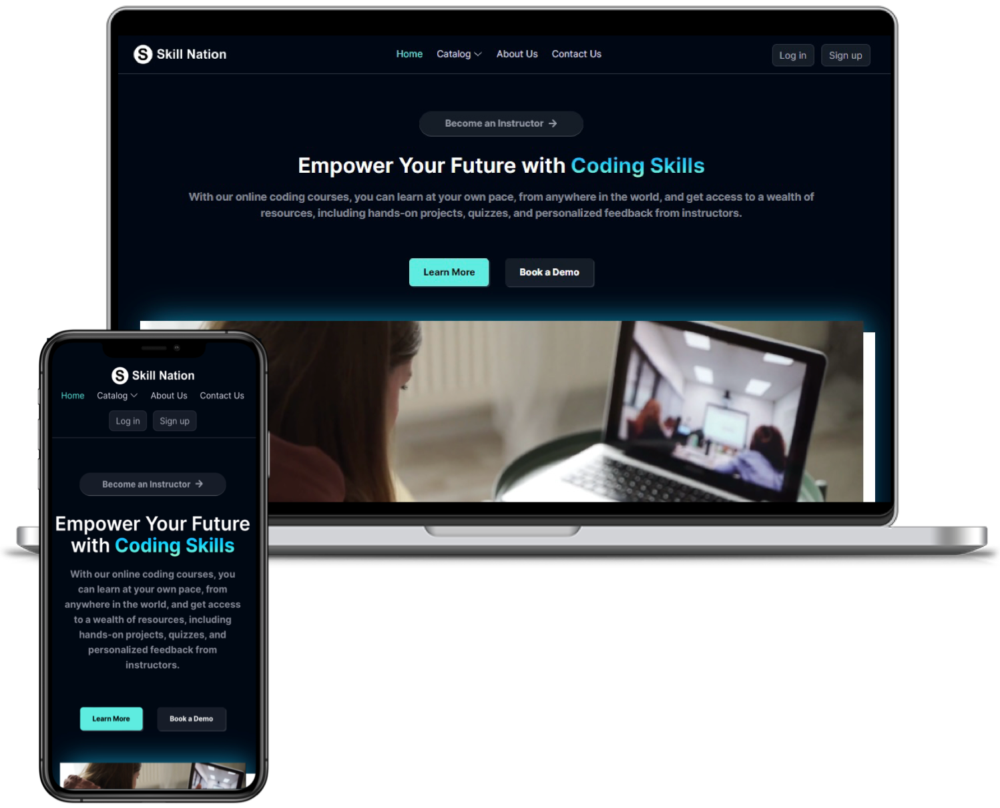

<h6 align="center">
</h6>
<h1 align="center"><a href="https://skillnation.vercel.app/">Skill-Nation an EdTech Platform</a></h1>

  

<h3><a href="https://skillnation.vercel.app/">skillnation.vercel.app/</a> </h3>

##  Project Description

- Skill Nation is a fully functional ed-tech platform that enables users to create, consume, and rate educational
content.
- In this Content-driven webapp Authorised user can Buy the courses, Instructor can Create the courses to Sell and Admin can Manages the platform
- Created using React.JS and Tailwind CSS for front-end development and Express.JS and Node.JS for back-end
development and MongoDB for Database storage
- Deployed the webapp back-end on RENDER and front-end on VERCEL, ensuring fast global delivery and automatic scaling

## 💻 Features

- User Authentication and Authorization using JWT (JSON Web Tokens) 
- Payment Integration: Razorpay integration for payment handling.
- OTP verification and forgot password functionality for added security
- Bcrypt: Bcrypt is used for password hashing
- Video playback functionality
- Cloud-based media management: using Cloudinary, to store and manage all media content

##  API Testing

- Tested the available API endpoints, the required parameters for each endpoint, the expected responses, authentication methods and examples to demonstrate usage of Skill Nation API via the POSTMAN platform 
- The description of the API design, list of API endpoints, their functionalities, and sample API requests and responses
- Here's the complete overview of Skill Nation API testing
<pre>
<a href="https://documenter.getpostman.com/view/17664276/2s9Y5YS2ky">View Postman Documentation</a>
</pre>

##  Architecture Diagram

- MongoDB is used as the primary database
- Node.js is used as the primary framework for the back end
- Express.js is used as a web application framework
- Mongoose is used as an Object Data Modeling (ODM) library, providing a way to interact with MongoDB using JavaScript.

- Here is a high-level diagram that illustrates the architecture of the StudyNotion ed-tech
platform:

<h6 align="center">
</h6>

##  Data Models

- The back end of Skill Nation uses a range of data models and database schemas to manage data
- The back end provides APIs for the front end to consume, which include functionalities such as user authentication, course creation, and course consumption.
- The back end also handles the logic for processing and storing the course content and user data

<h6 align="center">
</h6>

##  Getting started

The frontend was bootstrapped with Create React App. In the project root directory, run `npm install` to install all project dependencies. Next, run `npm start` to start the developmental server which will trigger open your default browser to `localhost:3000`. Run `npm install` and `npm run dev` in [`server`](./server) directory to set up the Express server.

### To set up frontend...

**Add `.env` file in root and write:**
<pre>
REACT_APP_SERVER=http://localhost:4000/api/v1/
</pre>

##  Tools and Frameworks

<h6 align="center">      </h6>

## Contributing

Here are a few general instructions for people willing to develop onto the codebase.
#### Step 1

-  Fork this repo!
-  Clone this repo to your local machine.

#### Step 2

- Build your code 

#### Step 3

- 🔃 Create a new pull request.

### • Create issues to discuss your ideas 

Creating issues before starting to work on your pull request helps you stay on the right track. 

### • Keep the code clean

Follow the code formatting standards of the repository by referring to existing source files.

### • Comments are the best

Make it clear what hacks you've used to keep this website afloat. Your work needs to be understood first, before getting appreciated (or criticised).

### • Keep the Contributors section up-to-date

Just so that everyone knows whose fault it is if things get screwed up.

 

